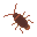

# 153 ROOM
## Работали над проектом:
* [x] *Наседкин Иван - ТехЛид*
* [x] *Пронин Аркадий - ТимЛид*
* [x] *Шифрин марк - Геймдизайнер*
## Коротко о проекте
* Игра в жанре Tower Defence, главная задача - защитить холодильник от вредителей. Для этого на игровом поле можно расставлять оружие.
### Оружие 
* Тапок - стандартное оружие с большой площадью поражения и неплохим уроном.
* Дихлофоз - узконаправленное оружие, для поражения узкого участка, имеет маленький урон, который компенсируется низкой задержкой
* Ловушка - точечное оружие, малоэффективно против групп противников, зато очень эффективно против 1 цели, наносит большой урон, но имеет очень большую задержку
### Противники
* Таракан - основной вредитель, пытается взять числом, имеет нормальную скорость, нормальное хп.
* Мышь - Сильный вредитель, появляется каждые 5 волн, имеет малую скорость, очень большое хп.
### События
* Ремонт - у вас что-то сломалось, необходимо заменить это заменить, отнимает стипубли.
* Приход Коменданта - осматривает квартиру, в зависимости от числа тараканов на поле решает, что делать, может как дать немного стипублей, так и отнять их.
* Стипендия - повышает количество стипублей после каждой волны.

## Объекты, использованные в проекте
* Игровое поле 

* Противники
* * Таракан 
* * Мышь 
* Оружие
* * Тапок 
* * Дихлофоз 
* * Ловушка 
